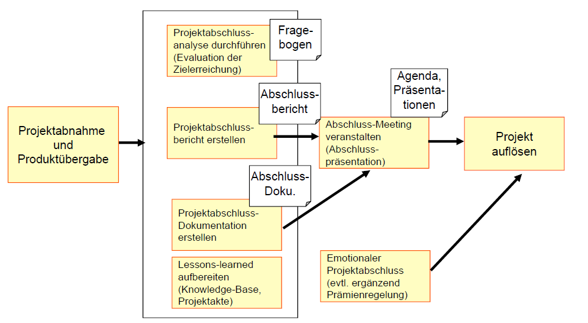
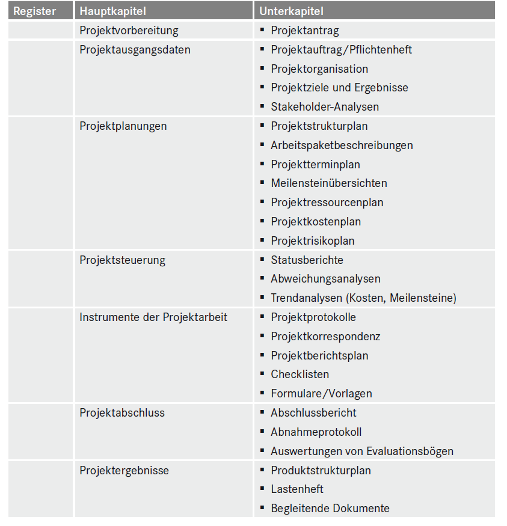

# Erfolgreicher Abschluss
 
Viele IT-Projekte werden Aufgrund von Ressourcenmangel, keine Energie auf das Projekt oder fehlende Bereitschaft nicht richtig Abgeschlossen oder gar nicht Abgeschlossen. Aufgrund dessen gibt es gefahren was passieren kann, z.B das die Projektarbeit sich verzögert, man die Akzeptanz des Auftraggebers verliert oder wichtige Erfahrungen verloren gehen.
Für diesen Fall gibt es eine Grafik die das Problem behandelt:

Bei der Projektabnahme bzw. Produktübergabe hilft es einem ein Abnahmetest durchzuführen. Es werden Fehler erfasst, bewertet und geeignete Maßnahmen eingeleitet. Desweiterem wird ein Protokoll durchgeführt was die Einzeltest, Ergebnisse, Testumwelt, Testläufe und aufgetretene Fehler mit Ursachenanalyse protokolliert.
Eine zweite variante ist die Projektabschlusssitzung. Hier wird diskutiert und geprüft ob die Schwerpunkte erreicht worden sind.
Die letzte Variante ist das Abnahmeprotokoll. Ein Protokoll wird dem Auftraggeber gegeben und anschließend wird es bewertet und eventuell nachgebessert.

Nach der Projektabnahme wird eine Projektabschlussanalyse durchgeführt. Man unterscheidet zwischen interne und externe Projektabschlussanalyse. Die interne Projektabschlussanalyse ist eine Abweichungsanalyse, also wie sehr sind die Projekt- und Produktparameter vom Plan abgewichen. Bei der externe Projektabschlussanalyse wird die Kundenzufriedenheit festgestellt und analysiert.
Desweiterem kann man einem Fragenbogen Teammitglieder nach der Projekterfahrung befragen:

Danach wird ein Projektabschlussbericht erstellt, indem für den Auftraggeber eine Bilanz zu dem IT-Projekt dargestellt wird. Mögliche gliederungsvorgaben könnten sein: Formal und inhaltliche Standards, Präzise Angaben der laufenden Kosten, Einvernehmlich von einem Projektbeauftragtem und Projektleiter erfasst und unterschrieben. Ein Mögliches Inhaltsverzeichnis könnte so aussehen:

Merkmale einer guten Projektdokumentation sind: klar und einheitlich strukturiert, verfügt über Referenzen, Begriffserklärungen, Beispiele, Grafiken … usw., ausgewiesenen Autor, unkompliziert geschrieben und jedes Teammitglied trägt dazu bei.

Nach der Projektdokumentation muss man die Projekterfahrungen sichern. Man kann zum Beispiel ein Feedback-Meeting aufstellen, indem geklärt wird was jeder im Team gelernt hat, welche Ergebnisse wichtig waren, welche positive Erfahrungen in anderen Projekten Anwendung finden und was zukünftig anders gemacht werden könnte.

Nach all dem, wird ein Abschluss-Meeting mit den Auftraggeber gehalten. Das ist eine Präsentation wo folgende Sachen besprochen werden: Projektergebnisse vorstellen, vergleich der realisierten Leistungsmerkmale mit dem Anforderungskatalog bzw. dem
Lasten- und Pflichtenheft, Gegenüberstellung der geplanten und erreichten Termine, Gegenüberstellung der Plan- und Ist-Werte von Aufwand und Kosten, Darstellung der durchgeführten Maßnahmen zur Qualitätssicherung, Analyse der aufgetretenen Schwierigkeiten und Planabweichung, Vorstellung projektspezifische Kennzahlen, Konzept zur Versteigung der Projektergebnisse, Vorlage eines Personalüberleitungs- und Ressourcenverwertungsplans.

Vor oder nach dem Abschluss-Meeting sollte man ein Emotionalen Projektabschluss und Projektauflösungen in Form einer Abschlussfeier durchführen. Hier wird nach außen signalisiert das das Projekt erfolgreich Abgeschlossen ist. Außerdem soll der Teamleiter eine Rede halten um das Team zu ehren.

Nach all den Prozessen heißt es die Projektergebnisse erfolgreich einsetzten und versteigern, deswegen sollte man die Erfahrungen dokumentieren und kommunizieren um für spätere Projekte diese einzusetzen.
