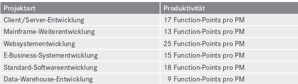
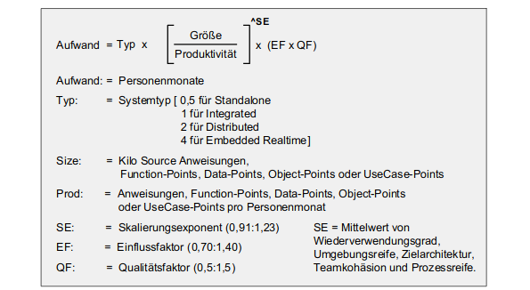
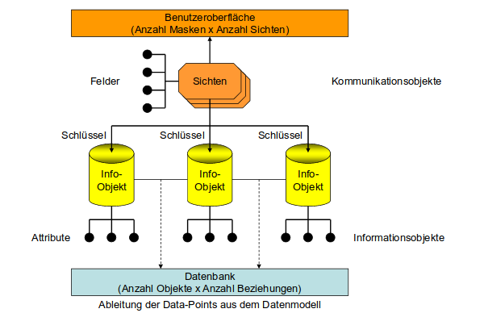
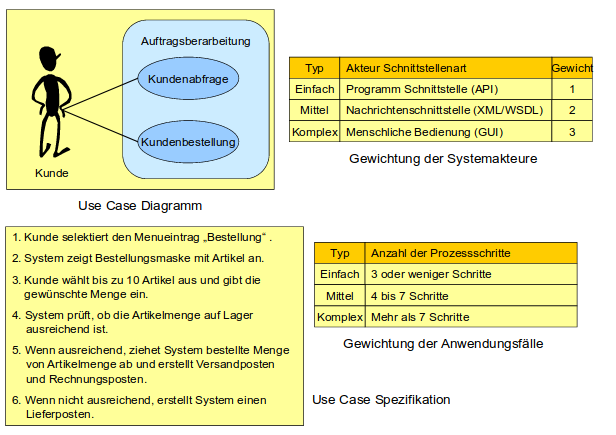

# Aufwandsabschätzung
 
Zur Erstellung eines Kostenplans und zur Wirtschaftlichen Analyse ist es erforderlich, dass
man den Aufwand seines Projekts abschätzt. Im großen Ganzen lässt sich sagen, dass sich die
Projektkosten aus Personalkosten + Hardwarekosten + Softwarekosten + Overhead-Kosten
zusammensetzten. Des Weiteren ist es für die Kostenübersicht wichtig sich darüber klar zu
sein, welche Art von Projekt man hat. Projekte unterscheiden sich in: denen die Kosten nach
Aufwand zu tragen sind, denen die Kosten fixiert sind und denen ein Teil der Kosten nach
Aufwand und ein Teil nach Festpreis bestimmt sind. Je nachdem ergibt sich auch der
Kostenplan für das eigene Projekt.

Der zweite Zweck einer Aufwandsabschätzung ist das Sammeln der Daten für ein
Festpreisangebot. Da immer mehr Projekte nach außen vergeben werden, ist es wichtig für
sich selbst eine Aufwandsabschätzung zu machen, um den entsprechenden Preis
einzuschätzen.

Ein dritter Zweck ist, dass die minimale Projektlaufzeit ermittelt werden kann. Das kann
wichtig sein da, wenn ein Produkt nicht bis zu einem bestimmten Termin zur Verfügung
steht, verliert es an Wert. Wenn man also schon früh sieht, dass ein Produkt nicht rechtzeitig
fertig werden würde, kann man Kosten und Zeit sparen, indem man es nicht realisiert.

Der vierte Zweck ist die Ressourcenbedarfsermittlung. Durch Ermittlung des Aufwands
können Aussagen über benötigtes Personal, Computer, Materialien und so weiter getroffen werden.

Der fünfte Zweck der Aufwandsabschätzung ist die Bereitstellung eines Maßstabs, mit dem
man den Projektfortschritt messen kann. So erhält man beim Vergleich von zwei abgeschätzten Projekten einen Vergleichswert. So könnte man sich entscheiden welches Projekt realisiert werden soll.

Jedoch bevor das eigentliche Schätzungsverfahren beginnt, gilt es nahezu unzählige Faktoren
zu beachten. Zu diesen Faktoren zählen selbst Dinge wie den Biorhythmus der Mitarbeiter
oder die zur Verfügung stehenden Werkzeugausstattung. Des weiteren gibt es verschiedene
Projekttypen: Prototypprojekte, Entwicklungsprojekte, Weiterentwicklungsprojekte,
Wartungsprojekte, Sanierungsprojekte, Installationsprojekte, Migrationsprojekte und
Integrationsprojekte, die es zu beachten gibt. Die Zuordnung in eines von diesen genannten
IT-Projekten ist für die Aufwandsabschätzung unabdingbar.

-Prototypprojekte sind Entwicklungsprojekte, bei denen das Ziel der Entwicklung nicht
bekannt ist. Daher es nahezu nicht möglich deren Aufwand abzuschätzen.

-Entwicklungsprojekte sind im Gegensatz zu Prototypenprojekten spezifiziert. Da vorher
beschrieben wird was gefordert ist, ist es leichter den Aufwand zu identifizieren.

-Weiterentwicklungsprojekte gehen von einem bestehenden IT-System aus. Hier werden
zusätzliche Funktionen in das bestehende System eingebaut. Es ist durchaus möglich hier
einen Aufwand abzuschätzen, wenn es genaue Anforderungen gibt die, die
Weiterentwicklung spezifizieren.

-Wartungsprojekte werden vorgenommen, um ein bestehendes IT-System nachzubessern
und/oder zu ändern. Der Aufwand ist bei solchen Projekten nur selten vorherzusehen da
meist unbekannte Probleme auftreten.

-Sanierungsprojekte sind einmalige, zeitlich und kostenmäßig begrenzte Anstrengungen,
bestehende IT-Systeme zu renovieren, damit man mit ihnen leichter umgehen kann. Sie
sollen performanter, wartungsfreundlicher und wiederverwendbarer werden. Solche Projekte
werden anhand des geschätzten Codes beurteilt. In der Praxis ist dies nicht immer ganz
einfach, da unerwartete Fehler im System auftreten können.

-Migrationsprojekte sind hingegen zeitlich und kostenmäßig begrenzte Anstrengungen,
bestehende IT-Systeme in eine andere technische Umgebung zu versetzen. Beispielsweise
wird die Programmiersprache in einem System getauscht. Der Aufwand wird ähnlich wie
beim Sanierungsprojekt in Code Zeilen geschätzt.

-Integrationsprojekte zielen darauf hin, bestehende IT-Systeme miteinander oder ein neues
System in einen Verbund bestehender Systeme zu integrieren. Immer mehr Anwender
verfügen über einen Verbund von IT-Systemen. Solche Projekte haben eine eigene
Gesetzmäßigkeit und dürfen mit normalen Entwicklungsprojekten nicht verglichen werden,
da sie über weit mehr technischen Know-how, anspruchsvolle Werkzeuge und einen großen
Testaufwand haben.

-In Installationsprojekten werden Standart-IT-Produkte in einen Anwenderbetrieb
organisatorisch und technisch eingeführt. Hierbei lässt sich der Aufwand sehr gut
abschätzen. Ein weiterer Faktor ist die Projektarbeitsbedingung. Das bedeutet inwieweit Büroräume,
Material etc. benötigt wird oder schon zur Verfügung steht. So benötigt man keine
Zeit/Kosten, wenn alle Mittel noch vom letzten Projekt zur Verfügung stehen.
Der nächste Faktor sind die Projektwerkzeuge, sie spielen eine entscheidende Rolle, vor
allem bei bestimmten Projekttypen wie Sanierung oder Integrationsprojekten. Als einfaches
Beispiel je schneller der PC ist, desto schneller lässt sich benötigte Software installieren und
umso schneller kann man damit arbeiten.

Der jedoch entschiedenste Faktor ist das Personal. Die Schwierigkeit liegt allerdings in der
Produktivitätsmessung eines Mitarbeiters. Die Produktivität setzt sich wie folgt zusammen
Produktivität = (Quantität x Komplexität x Qualität) / Aufwand. Ein Beispiel: Ein Projekt,
dass 20 Personenmonate gekostet hat und ein Ergebnis von 10 000 Anweisungen mit einem
Komplexitätsfaktor von 1,2 und einem Qualitätsfaktor von 0,9 hat, ergibt 540 Anweisungen
pro Personenmonat. Das Problem bei einer solchen Berechnung ist, wie bestimmt man einen
Komplexitätsfaktor oder einen Qualitätsfaktor? Hier liegt das Problem bei dieser Art der
Aufwandsabschätzung, diese Werte sind reine Ermessenssache.

Die David-Consulting-Gruppe hat Produktivitätsdaten in Function-Points gesammelt. Daran
ist zu sehen, dass die Produktivität zwischen 9 und 25 Function-Points pro Personenmonat
variiert. Also haben die Tätigkeiten schonmal von Grund auf andere Faktoren, die zu
Messung mit einbezogen werden müssen.

Festzuhalten ist das die Messung einer Person gar nicht so einfach zu erfassen ist, es hängt
zum einen von der geforderten Tätigkeit aber auch von der Person selbst ab.
Was bleibt, ist die Frage, wie man die Größe eines IT-Vorhabens misst. Um eine
Produktgrößenmessung zu machen, kann man unterschiedlich vorgeben. Man kann nach
Codezeile, Codeanweisungen, Function Points, Data-Points, Object-points, Use-Case-Points
und Story-Points Schätzen.

Die Codezeilen Schätzung erfolgt so, dass wie erwartet die benötigten Codezeilen geschätzt
werden. Es wurde eine folgende Formel aufgestellt: Größe (in Zeilen) = (Aufwand)^1/3 x
(Zeit)^4/3 x Produktivität. Diese Methode ist jedoch vergleichsweise sehr "alt" und ungenau
da die Produktivität wieder ein Faktor ist, der persönlich zu bewerten ist.

Die Schätzung nach Codeanweisungen entstand dadurch, das mehrere Projekte angeschaut
wurden. Aus diesen Projekten wurden die am Ende vom Projekt ausgelieferten Anweisungen
gezählt - Kilo delivered source instructions = KDSI. Diese KDSI werden benötigt, um den
Aufwand des Projekts abzuschätzen. Es entstanden mehrere Formeln wie Aufwand = 2,4
(KDSI)^1,05. Der Faktor 2,4 ist ein Justierungsfaktor der je nach Systemtyp einzustellen ist.
Bei dem Beispiel steht 2,4 für standalone, monoitgische Anwendungen. Im Laufe der Zeit
veränderte sich die Formel für verschieden Bedürfnisse. So entstand der so genannte
COCOMO-II-Schätzugsalgorithmus, doch auch dieser war zu ungenau.

Nachdem die Probleme der Codemessung erkannt wurden, entschied man sich für eine
Schätzung mit Function-Points. Das Prinzip dabei war Punkte für bestimmte
Datenbewegungstypen zu vergeben. Doch heute scheint diese Methode rätselhaft da Ausgabe
nicht gleich Ausgabe ist.

Die Schätzung nach Data-Points entstand in den 1980er-Jahren. Da in dieser Zeit
Datenbanken immer interessanter wurden, musste man diese mit in die Aufwandsabschätzung
mit einbeziehen. Es entstand das folgende Data-Point-methoden Modell von Harry M.
Sneed.

Diese Methode ging von Informationen aus, die man dem Datenmodell entnehmen konnte.
Sichtbar waren die Datenentitäten und zumindest ein Teil ihrer Attribute, die Schlüssel der
Datenentitäten, die Beziehung der Datenentitäten untereinander und die Sichten auf die
Datenentitäten und der Großteil ihrer Attribute. Es bleibt nur übrig, diese sichtbaren
Datenelemente auf Grund ihrer Komplexität zu Gewichten. Diese Gewichtung ist aber nur
aufgeteilt in 2=niedrig, 4=mittel oder 8=hoch. Dies ist wesentlich besser als die vorher
genannten Schätzungsmethoden. Die Data-Points des Datenmodells werden als
Information-Points angesehen und die Benutzeroberfläche als Communications-Points.
Diese können wir folgt berechnet werden Informations-Points = Summe der
Entitäten[Attribute + (Schlüssel x 4) + (Beziehung x 2)] und Communication-Points =
Summe von Sicht [Attribute + (2,4,8) +(Beziehungen)].
Eine weitere Art ist die Schätzung nach Object-Points. Diese Methode wiegt die
Bestandszeile von Modellen. Die Punktevergabe sieht aus wie folgt: In den
Klassendiagrammen wiegt:

Jede Klasse = 4, jedes nicht geerbte Attribut = 1, jede nicht geerbte Methode = 3, jede
Klassenassoziation = 2.
In den Sequenzdiagrammen wiegt: jede Nachricht = 2, jeder Parameter = 1, jeder Sender = 2,
jeder potenzielle Empfänger = 2.
(Abbildung 9.6 S.22 Aufwands.)
In den Use-Case-Diagrammen wiegt: jeder Online-Anwendungsfall = 2 x Anzahl der
Ausgänge, jeder Batch-Anwendungsfall = 4 x Anzahl der Ausgänge, jeder
Systemanwendungsfall = 8 x Anzahl der Ausgänge.
Hinzu kommt eine Komplexitätsbewertung für jede Klasse, jede Nachricht und jeden
Anwendungsfall, wonach sich;

niedrige Komplexität = 75% der Object-points
mittlere Komplexität = 100% der Object-points
hohe Komplexität = 125% der Object-points
ergeben. 

Schließlich folgt der Wiederverwendungsgrad. Die Object-Points von wiederverwendeten
Klassen, Nachrichten und Anwendungsfällen werden nur mit dem Prozentanteil gezählt, mit
dem das Element nicht wiederverwendet wird. Zum Beispiel wiegt eine Klasse mit 20
Object-Points, die zu 60% wiederverwendet wird(d.h. nur 40% des Codes kommen neu
hinzu), nur 60% der Klasse bzw. 12 Obejct-Points bestehen schon. Diese Einbeziehung des
Wiederverwendungsanteils auf der elementaren Stufe ist gerade bei der Objektorientierung
von besonderer Bedeutung.

Die Use-Case-Methode für die Schätzung einer Softwareentwicklung entstand im Jahr 1993.
Eine Schätzung nach der Use-Case-point-Methode vollzieht sich in fünf Schritten:
Klassifizierung der Systemakteure, Gewichtung des Anwendungsfalls, Justierung der rohen
Use-Case-Points-Zahl durch produktbezogene Einflussfaktoren, Umsetzung der justierten
Use-Case-Points in Personenaufwand. Im ersten Schritt werden die Systemschnittstellen in
drei Klassen geteilt: einfache Systemschnittstellen, mittel komplexe Systemschnittstellen und
komplexe Systemschnittstellen. Als Nächstes werden die Anwendungsfälle nach
Komplexitätsstufen gewichtet (Unadjusted Use Case Weight (UCCW)).

Der dritte Schritt in der Use-Case-Point-Methode ist die Justierung der Systemgröße in
Reihen Use-Case-Points durch die 65 Produkteinflussfaktoren. TCF = 0,65 + [0,01 x TF] TF
= Summe der Gewichtung der produktbezogenen Einflussfaktoren. ECF = 1,35 - [0,02 x
EF)] EF = Summe der Gewichte der projektbezogenen Einflussfaktoren. UCP = UUCP x
TCF x ECF. UUCP = rohe Use-Case-Points. Am Ende wird alles zusammengerechnet.
Aufwand = UCP x Produktivität. Produktivität = Arbeitsstunde pro Use-Case-Point. Use-
Case-Points werden gezählt, wenn die Use-Cases in dem Anforderungsdokument spezifiziert
sind.

Die letzte Schätzungsmethode geht mit Story-Points, diese eignet sich besonders für agile
Softwareentwicklung. Story-Points beziehen sich nicht auf die Eigenschaften des Produkts,
sie beziehen sich auf die relative Produktivität des Teams. Es gibt keine genaue Definierung
für die Story-Points, es geht darum das eine Arbeitsgruppe an ihren bisherigen Projekten
gemessen wird. Als Beispiel, wenn ein Team mit einem Projekt 10 Monate beschäftigt ist,
wird es für ein ähnliches Projekt auch wieder 10 Monate dauern.
Um nun ein Größenmaß zu bestimmen, müssen wir den Projekttyp kennen und dann können
wir darauf eines der genannten Schätzungsmethoden anwenden. Für jeden Projekttyp
empfehlen sich ein oder mehr Schätzungsmethoden.

Prototypprojekt = Story-Points
Entwicklungsprojekt = Use-Case-Points, Obejct-Points und Codeanweisungen
Weiterentwicklungsprojekte = Codeanweisungen und Obejct-Points
Wartungsprojekte = Codezeilen, Codeanweisungen und Obcejt-Points
Sanierungsprojekte = Codezeilen, Codeanweisungen und Obcejt-Points
Migrationsprojekte = Codeanweisungen, Obcejt-Points und Data-Points
Integrationsprojekte = Object-Points und Data-Points
