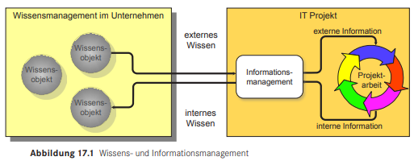
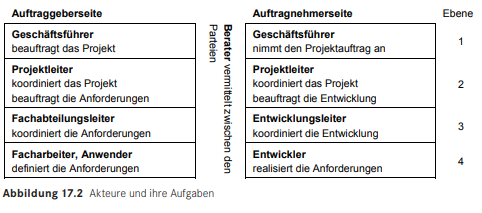

# Informations- und Wissensmanagement im IT- Projekt

## Nach Nikolai Bauer und Jens Hauptmann

### Informationsversorgung

Die Versorgung aller Beteiligten an einem Projekt mit Informationen scheint zunächst recht einfach. Bei genauerer Betrachtung wird jedoch schnell klar, dass dieser Essentielle Punkt in der Projektentwicklung ein komplexes Thema ist. Häufig werden Informationen nicht wahrgenommen, weitergegeben oder gar nicht erst versendet. Dies führt wiederum dazu, dass selbst ein qualifiziertes und engagiertes Team ein Projekt nicht umgesetzt bekommt. Es ist darauf zu achten, eine Passende Methode zu finden, um Informationen in der gesamten Projektentwicklung zu erzeugen, für die bestimmten Beteiligten zugänglich zu machen und sicherzustellen, dass diese auch genutzt werden.     
**E-Mail** *– das beliebteste Kommunikationsmittel*
Zunächst scheint es eine einfache und gute Lösung zu sein mit E-Mails zu arbeiten, jedoch sammeln sie sich über einen längeren Zeitraum an, so können während des Projekts mehrere tausende E-Mails entstehen. Diese zu managen ist sowohl zeitaufwändig, als auch kompliziert. Schnell können dadurch wichtige Informationen verloren gehen, was wiederum dem Projekt schadet. 

**Das Krisenmeeting** *– häufig Folge schlechter Informationsversorgung*
Wenn erst einmal Informationsprobleme entstehen, fällt dies meist zunächst gar nicht auf. Diese Probleme können sich schnell anhäufen und fordern meist ein umgehendes Kriesenmeeting, in welchem entstandene Fehler und Informationslücken ausgemerzt werden müssen. Nicht nur ist dies Zeitaufwändig, es kostet auch Ressourcen, welche an anderen Stellen genutzt werden können. Im schlimmsten Fall kann es auch zu einem Projektabbruch führen, sollten die entstandenen Probleme zu weit herangewachsen sein oder Auftraggeber nicht mit vereinbarten Informationen versorgt worden sein.  

**Die Informationsversorgung ist ein wichtiges Projektziel**
Wie wichtig eine Informationsversorgung ist, die effizient und auf die Bedürfnisse der Projektteilnehmer abgestimmt ist, sollte nun klar sein. Ziel einer guten Projektorganisation sollte sein, alle Teilnehmer zu jeder Zeit möglichst aktuell und vor allem einheitlich zu informieren. Ein veralteter Wissensstand oder ein unterschiedlicher Informationsstand bei verschiedenen Personen führen zu unnötigen Diskussionen, zu Missverständnissen und Fehlentscheidungen.

### Informationsmanagement und Wissensmanagement

**Externes Wissen:**
Unter diesem Punkt lassen sich einige Aspekte zusammenfassen. Als externes Wissen werden alle Informationen zusammengefasst, welche nicht innerhalb des Projekts entstanden ist. 

**Internes Wissen:**
Als internes Wissen beschreibt man alle Informationen, welche innerhalb des Projekts entstehen, so besteht dies meist aus Inhalten zu dem Projektfortschritt.

Es muss daher dafür gesorgt werden, dass ein stätiger Austausch zwischen den intern Agierenden und den externen Quellen herrscht.

### Aspekte eines effizienten Informationsmanagements

**Bewertungskriterien:**
In der modernen Projektarbeit gibt keine Form des Informationsmanagements, welche allgemeingültig Funktioniert. Jedoch gibt es einige Punkte, an denen sich orientiert werden kann, die Gewichtung dieser Punkte wird durch verschiedene Faktoren bestimmt, es gilt auf Flexibilität, Effizienz, Kontinuität, Personalisierung und Akzeptanz zu achten. Da Projekte sich immer unterscheiden kann es sein, dass selbst ein eingespieltes Team ihre Methode des Informationsmanagements vom einen auf das andere Projekt ändern muss. Daher sollte dieser Aspekt direkt in die Projektplanung aufgenommen werden.  
Anhand der natürlichen Einschränkungen entstehen jedoch gewisse Typische Muster, die gewisse Praktiken vorgeben.

**Typische Muster beim Umgang mit Informationen:**
* Lagezentrum als Informationsquelle - Es sollte immer ein Ort festgelegt werden, an welchem alle Informationen abgelegt werden, dies bedeutet nicht, dass Informationen nur an diesem Ort abgelegt werden, sondern sie zusätzlich nachvollziehbar gesichert werden sollten.
* Diskussionskultur - Ein digital abgesicherter Austausch an Informationen, zwischen einer oder mehreren Personen.
* Individuelle Abstimmung - Vielen Mitarbeitern hilft es eine personalisierte Form der Informationen zu erhalten, da sie diese unterschiedlich gut aufnehmen.
* Private Kommunikation - Eine direkte Kommunikation von Informationen zwischen Mitarbeitern, welche nicht Dokumentiert werden müssen. Sie können private Informationen enthalten und spontan geschehen.
* Dashboards - Eine schnelle Darstellung der wichtigsten Informationen, sie kann sowohl digital als auch physisch ausgeführt werden.
* Schlechte Nachrichten - Werden oft vermieden, sollten jedoch immer an die passenden Stellen im Informationssystem weitergegeben werden.
* Kommunikation mit dem Auftraggeber - Muss nach vertraglichen Vereinbarungen durchgeführt werden. Häufig ist es auch angebracht über die benötigten Informationen herausgehend Inhalte anzubieten, welche Relevant sein können.   
* Information als Mittel zur Verfolgung strategischer Interessen – Das absichtliche Verschweigen an Informationen kann sowohl positive als auch negative Inhalte betreffen. Häufig wird dies im Marketing eingesetzt.

**Ubiquitous Computing:**
Heutzutage sollten nicht nur die simplen Strukturen innerhalb des Projekts genutzt werden, so ermöglichen Mobilgeräte, sowie Internet Anwendungen den Austausch an Informationen, selbst wenn der Mitarbeiter selbst nicht an seinem Arbeitsplatz sitzt. Es lassen sich so schnell kleinere Informationen verbreiten, für größere Inhalte sollte dies jedoch nur angemessen genutzt werden.

**Datenschutz in IT-Projekten:**
Das schützen von Informationen und Daten ist im IT-Bereich unumgänglich, Informationen sollten klar nach ihrer Vertraulichkeit kategorisiert sein. Durch die Herausgabe der falschen Daten kann es zu massiven Problemen kommen, daher ist es oberste Priorität rechtzeitig und in angebrachtem Maß Informationen zu sichern. Insbesondere durch ausgelagerte Informationsmanagement-Systeme entsteht ein großes Gefahrenpotenzial.

### Der Informationsfluss in IT-Projekten   

Typische Akteure in einem Projekt: 

Strukturierung der Akteure nach Ebenen:
1.	Business-Kontext 
  * Überwacht als oberste Instanz die strategischen sowie kaufmännischen Aspekte des Projektverlaufs.
2.	Management-Kontext 
  * Koordiniert die Anforderungen des Projekts und synchronisiert den Status. Der aktuelle Trend hin zu sehr flexiblen, sogenannten agilen Entwicklungsprojekten, bei denen sich Anforderungen und Projektverlauf ständig ändern können, bedeutet für diese Ebene großen Bedarf an einer optimalen Informationsversorgung.   
3.	Konzept und Design-Kontext 
  * Beinhaltet den produktiven Kern des Projekts. In dieser Ebene wird die zu erledigende Arbeit konzipiert und koordiniert.
4.	Worker-Kontext 
  * Besteht aus den Nutznießern des Projekts, etwa den zukünftigen Benutzern und den Entwicklern, die deren Anforderungen umzusetzen haben.   
  
**Informationsflüsse:**
* Kaufmännischer Informationsfluss,
* Technischer Informationsfluss,
* Fachlicher Informationsfluss,
* Organisatorischer, administrativer Informationsfluss.

### Organisation und Etablierung eines Informationsmanagements

**Informations-Middleware** 
Mit dem Begriff „Middleware“ werden in der Informatik Systeme bezeichnet, die den Datenaustausch zwischen Anwendungen erleichtern, indem sie zwischen diesen Systemen vermitteln und dabei vor allem die Komplexität der Applikationen verbergen. Genau diesen Anspruch muss auch die Informationsversorgung innerhalb eines IT-Projekts, haben. Das heißt konkret, dass bei der Organisation des Projekts darauf geachtet werden soll, dass die für die Verwaltung der Informationen genutzte Infrastruktur diesen Ansprüchen auch gerecht wird.

#### Lösungsansätze und Beispiele:

**Etablierte Systeme:**
* E-Mail,
* Dateiserver, 
* Versionsverwaltung,
* Wiki,
* Issue-Tracker,
* Projektmanagementsoftware.

**Zusätzliche Systeme:**
* Informationsportal,
* Blog,
* Instant Messaging.

