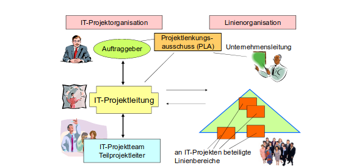
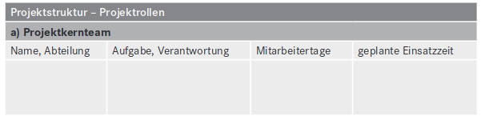
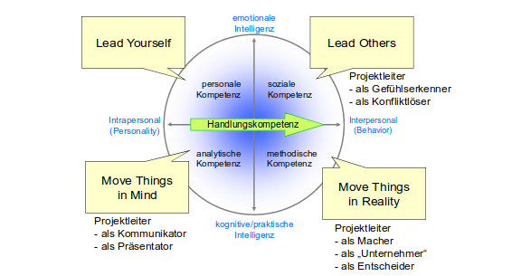
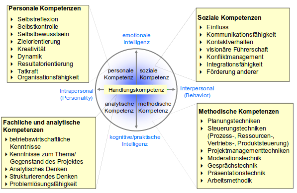

# Personalplanung
  
Ein wichtiger Teil für ein erfolgreiches Projekt ist der personelle Faktor. Ein Projekt kann
ohne kompetente Mitarbeiter nicht zum erfolgreichen Abschluss gebracht werden. Darum ist
es wichtig sein Personal sorgfältig zu planen. Es hängt allerdings nicht alleinig vom
eingesetzten Personal ab ob ein Projekt erfolgreich ist, die Kompetenz der Projektleitung ist
ebenso wichtig.

Hier sind alle Beteiligten im IT-Projekt aufgeführt. Die Linienorganisation steht dabei eher
Beraten zur Seite. Dies können externe Mitarbeiter oder Experten auf ihrem jeweiligen
Gebiet sein.
Ein Bestandteil der Teambildung ist die Klärung der Rollen und deren Funktionen. Es ist
wichtig diese Dinge zu klären da es sonst zu Missverständnissen oder Problemen kommen
kann. Deshalb sollte zu Beginn eines Projekts folgendes geklärt werden: eine Definition der
wichtigsten Projektrollen, eine Beschreibung der wesentlichen Rollen der Teammitglieder im
Projekt, die Bildung des Projektteams, Darstellung der Projektaufbauorganisation und die
Vereinbarung zum Informationsfluss im Projekt.
Um eine Aufgabe im Projekt zu bewältigen empfiehlt es sich Teams innerhalb des Projekts
zu bilden. Diese Teams nehmen sich dann einem Arbeitspaket (welches vorher im Projekt-
Struktur-Plan festgelegt worden sind) an. Ein Team kann auch mehrere Arbeitspakete
abarbeiten. Grundsätzlich muss man sich für diese Dinge entscheiden: Anzahl der
Arbeitspakete, Anzahl und Art der Mitarbeiter pro Projekteinheit, Entscheidung über den
Einsatzzeitpunkt bzw. den Einsatzzeitraum der jeweiligen Teammitglieder, Ermittlung der
Gesamtanzahl der benötigten Projektmitglieder um Projekt und die Verteilung des Einsatzes
auf Projektphasen. Dies kann man mithilfe einer Tabelle realisieren.

Die Bildung eines Teams hängt von der zu erledigten Aufgabe ab so kann es sein das sich die
Teams untereinander neu mischen und wieder entzweien, es hängt immer von der jeweiligen
Kompetenz oder Spezialisierung des einzelnen ab.
Diese Kompetenzen und Spezialisierung werden auch bei der Personalauswahl
berücksichtigt. In der Traumvorstellung sucht sich ein Teamleiter sein Personal anhand von
"Skills" aus. Hier werden neben diesen "Skills" auch auf Team- sowieKommunikationsfähigkeit geachtet. In der Praxis sieht dies allerdings so, dass der
Projektleiter in seiner Wahl mehr oder weniger eingeschränkt ist. Deshalb ist es umso
wichtiger sein Projekt zu strukturieren und danach erst sein Personal zuzuordnen.
Die wichtigste Position im Projekt ist der Projektleiter, er ist verantwortlich für: das
Erreichen der im Projektauftrag formulierten Projektziele, das Einhalten des festgelegten
Zeit- und Kostenrahmens, den sach- und termingerechten Einsatz der Projektressourcen, das
Bereitstellen der Projektergebnisse gemäß den gesetzten Qualitätsanforderungen.

Daraus folgt, dass der Projektleiter der Hauptansprechpartner für das Projekt ist. Zudem ist er
auch das Bindeglied zwischen Auftaggeber und dem Projektteam. Deshalb sind von dem
Projektleiter mehrere Kompetenzen gefordert.

