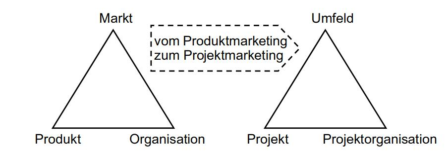
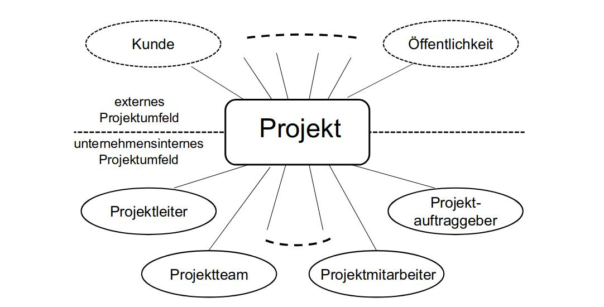
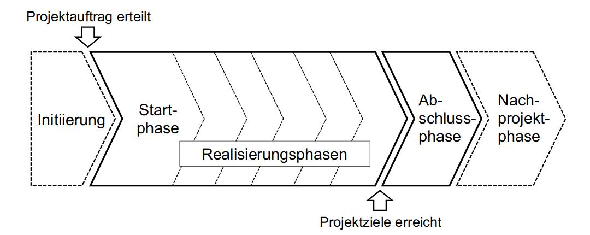

Nun, da der Begriff Stakeholder erläutert wurde, wird im Folgenden wieder auf das Marketing eingegangen, welches benötigt wird, um die Akzeptanz eines Stakeholders bezüglich eines Produkts zu gewinnen. Ein Grund für mangelnde Akzeptanz kann das nicht Berücksichtigen von Soft Facts sein. Soft Facts sind die emotionalen Einflussfaktoren. Hierzu gehören z.B., dass sich die Mitarbeiter mit dem Projekt identifizieren können. Wenn dies nicht der Fall ist, arbeiten sie weniger effizient. Dazu gehört auch, dass Mitwirkende über die Bedeutung des Projekts für das Unternehmen aufgeklärt werden. Außerdem ist wichtig, dass die Stakeholder vertrauen in das Projektteam und das Projektmanagement haben.

In diesem Zusammenhang wird oft die Formel „Erfolg = Qualität x Akzeptanz“ genannt, welche aussagt, dass ein qualitativ hochwertiges Projekt, solange wie es nicht akzeptiert wird, auch keinen Erfolg hat. So ist es aber auch umgekehrt. Wenn ein Projekt zwar akzeptiert wird, aber nur eine geringe Qualität aufweist, ist es unter Umständen unbrauchbar und hat somit auch keinen Erfolg.

In diesem Zusammenhang ist ebenfalls das magische Dreieck des Projektmarketings zu erwähnen. Dieses besteht aus den drei Dimensionen "Produkt","Kosten" und "Termine". Das Erreichen dieser drei Dimensionen wurde für einen langen Zeitraum mit dem Erfolg eines Projekts gleichgesetzt. Dieses Dreieck lässt sich durch die Ebene "Mensch" zu einem magischen Viereck erweitern. Das magische Dreieck des Projektmarketings ist allerdings nicht zu verwechseln mit dem magischen Dreieck des Projektmanagements, welches aus den Dimensionen "Qualität der Ergebnisse", "Kosten" und "Zeitaufwand" besteht. Das Besondere an diesem Dreieck ist, dass sich die drei Faktoren gegenseitig beeinflussen. Des Weiteren existiert noch das strategische Dreieck des Produktmarketings, welches aus den Dimensionen "Produkt", "Markt" und "Organisation" besteht. Dieses lässt sich weiterführen zu dem strategischen Dreieck des Projektmarketings, welches aus den Dimensionen "Projekt", "Umfeld" und "Projektorganisation" besteht.

 
(IT-Projektmarketing Abbildung 16.1 S.563)

Es existieren verschiedene Definitionen zu Projektmarketing. Zusammengefasst lässt sich sagen, dass Projektmarketing die Aufgabe hat, den Bekanntheitsgrad eines Projekts zu erhöhen und die Bedeutung dieses Projekts zu verbreiten. So soll Akzeptanz im Projektumfeld für das Projekt geschaffen werden und der Projekterfolg somit strategisch abgesichert werden.
Dafür ist es notwendig, bei der Planung auf Vollständigkeit zu achten, da durch Informationsdefizite falsche Planungsergebnisse erzielt werden können. Dieses gilt auch bei der Gesamtdarstellung eines Projekts. Wenn einer Person zu wenige Informationen vorliegen, ersetzt diese die Lücken durch eigene Vorstellungen, was zu einem falschen Bild des Projekts führen kann. Dieses kann z.B. eintreten, wenn zu wenige Informationen darüber vorhanden sind, inwiefern das Projektergebnis dem Anwender nutzt oder nicht klar ersichtlich ist, was überhaupt das Ergebnis des Projekts und dessen geplanter Einsatz ist. Informationsmangel kann schon bereits im Projekttitel beginnen. Hier ist es wichtig, einen möglichst aussagekräftigen Titel zu wählen.
Es ist ebenfalls wichtig, sich vor Augen zu führen, dass in einem Unternehmen in der Regel verschiedene Denkansätze existieren. Die Entwicklungsabteilung hat einen lösungsorientierten Denkansatz, wohingegen die Vertriebsabteilung verkaufsorientiert denkt. Beides ist für ein erfolgreiches Projekt wichtig. 

An das IT-Projektmarketing stellen sich verschiedene Anforderungen. Die Anforderungen hängen zum einen davon ab, wie die Zielsetzung des Projekts lautet und wie Erfolg in dem Projekt definiert ist. Des Weiteren ist die Einstellung und das Verhalten des Projektumfelds wichtig. Außerdem orientieren sich die Anforderungen an der Charakteristik und der Art des Projekts. Letztere lässt sich in zwei Arten unterteilen. Es gibt externe Projekte, bei denen etwas für einen unternehmensexternen Auftraggeber produziert wird und es gibt interne Projekte, bei denen Produkte für die eigene Firma produziert werden. Bei internen Projekten, welche zu einer Veränderung führen, ist das Risiko für Ablehnung umso größer, desto mehr Personen betroffen sind. 
Damit es nicht zu Fehleinschätzungen kommt, besteht eine Anforderung des Projektmarketings darin, die bereits genannten Fehlinformationen zu vermeiden und Informationen so zu formulieren, dass diese so beim Empfänger ankommen, wie sie vom Sender gemeint sind. Es ist wichtig, sowohl die  Soft Facts als auch die Hard Facts zu beachten. Hard Facts sind die rationalen Faktoren in einem Projekt. Hierzu gehören z.B. der Kundennutzen und die eingesetzte Technologie. Diese sind wichtig, damit ein Projekt nach betriebswirtschaftlichen Werten beurteilt werden kann. Soft Facts, welche in Bezug auf den Kunden wichtig sind, sind z.B. die gesellschaftliche Position des Kunden und die Art der Geschäfte des Kunden. Je nach persönlichem Zustand hat dieser eine andere Haltung zum Projekt, z.B. in Bezug auf die Motivation zur Mitarbeit und die ethischen Grundsätze.

IT-Produkte ernten oftmals besonders viel Kritik. Hierfür gibt es verschiedene Gründe. Zum einen werden Problemsituationen von Anwendern durch die modernen Kommunikationstechniken der Anwender sofort erkannt und weiter verbreitet. Dadurch, dass sich ein IT-Produkt mit der Zeit verändert, ist es möglich, dass der Anwender jede Veränderung als Störfaktor empfindet. Auch ist es möglich, dass der Anwender mit dem Produkt überfordert ist und dieses der IT anhängt.
Jedes Projekt benötigt Projektmarketing. Allerdings muss das Marketing an jedes Projekt einzeln angepasst werden, da jedes Projekt einen unterschiedlichen Bedarf hat und verschiedene Werkzeuge und Methoden benötigt. Die Ziele des Projektmarketings lassen sich in interne und externe Ziele aufteilen. Interne Ziele konzentrieren sich vor allem auf das Projektteam. Zusätzlich konzentrieren sich diese auf das Management und eine positive Einstellung gegenüber des Projekts. Ein Ziel ist es, Mitarbeiter zu haben, welche sich mit dem Projekt identifizieren können. Dieses ist wichtig, damit die Mitarbeiter motiviert sind und somit effizienter arbeiten können. Dieser Punkt ist besonders wichtig, da die Motivation der Mitarbeiter ausschlaggebend für den Erfolg eines Projekts ist. Des Weiteren ist es wichtig, Mitarbeiter, die für das Projekt benötigt werden, rechtzeitig zu informieren, damit sie sich auf den Einsatz vorbereiten können. Generell ist es immer ratsam, möglichst transparent mit Informationen umzugehen, denn umso besser die Mitarbeiter informiert sind, desto besser können sie in Entscheidungsprozesse mit einbezogen werden. Es ist zudem sinnvoll, Eigenmarketing zu betreiben, wobei hier zu beachten ist, dass es unseriös wirken kann, wenn man ich selbst zu gut darstellt. Man könnte somit an Glaubwürdigkeit verlieren. Für Kunden ist oftmals nicht nur das Endprodukt, sondern auch der Entstehungsprozess wichtig, weshalb man den Entstehungsprozess immer gut dokumentieren sollte. Außerdem ist Kontinuität und Stabilität in einem Unternehmen wichtig, da die Mitarbeiter darauf vertrauen wollen. 
Externe Ziele konzentrieren sich auf die Kunden des Projekts und die Anwender des Produkts. Für den Fall, dass es sich bei dem Projekt um ein internes Projekt handelt, sind die vom Endprodukt betroffenen Mitarbeiter die Anwender. Auch bei den externen Zielen sind Informationen sehr wichtig. Wenn der Projektverlauf dem Kunden gut dargestellt wird, führt dieses zu einer Kundenbindung. Sofern die Projektidee nicht vom Kunden selbst kommt, ist es eine wichtige Aufgabe des Projektmarketings, die Projektidee bzw. die Realisierungskompetenz gut zu verkaufen und somit Kunden für sich zu gewinnen. Ein wichtiger Schritt hierfür ist es, die Marktpräsenz des Unternehmens bzw. des Projekts zu verbessern, um mögliche Kunden über die Kompetenzen des Unternehmens zu informieren. Eine attraktive Darstellung des Projekts hat aber nicht nur Auswirkungen nach außen, sondern auch nach innen. Mitarbeiter die ihr Projekt nach außen als gut repräsentiert wahrnehmen, sehen das Projekt als aufgewertet an, was ebenfalls zu einer Steigerung der Motivation führen kann. 

Bei einem Projekt gibt es immer ein externes und ein unternehmensinternes Projektumfeld. Der Kunde und die Öffentlichkeit gehören zum externen Projektumfeld. Der Projektleiter, das Projektteam, die Projektmitarbeiter und der Projektauftraggeber gehören zum unternehmensinternen Umfeld. Der Auftraggeber ist dafür verantwortlich, dass ein Projekt in einem Unternehmen genehmigt wird. Insofern es erforderlich ist, kann dieser weitere Erfolgsfaktoren definieren wie z.B. eine Kundenbindung oder einen Folgeauftrag. Wenn in der Projektorganisation kein Ansprechpartner für den Projektleiter und kein Entscheidungsträger festgelegt ist, übernimmt der Auftraggeber diese beiden Rollen. Der Projektleiter ist in einem Projekt für den Erfolg und ein wirkungsvolles Marketing zuständig. Das Projektteam stellt die zentrale Gruppe des Projekts dar. Es arbeitet über den gesamten Projektzeitraum zusammen und ist für die Realisierung verschiedener Aufgabenbereiche verantwortlich. Außerdem ist es für die Koordinierung der Mitarbeiter in den einzelnen Arbeitsgruppen zuständig. Die Projektmitarbeiter sind für die Bearbeitung der zugeteilten Aufgaben  zuständig. Außerdem verkörpern sie das Projekt nach außen. Des Weiteren gibt es noch Spezialisten und externe Mitarbeiter. Diese sind nur zeitweise mit dem Projekt verbunden und deshalb meist nicht direkt in das Projektteam mit einbezogen. Zuletzt gibt es noch Mitarbeiter komplett ohne Berührungspunkte zum Projekt. Als solche werden Mitarbeiter bezeichnet, welche zwar nicht mit dem Projekt in Verbindung stehen, aber dennoch Interesse an dem Projekt haben. 

 
(IT-Projektmarketing Abblildung 16.2 S.567)

Projektmarketingmaßnahmen werden in aktiv und passiv unterteilt. Als aktiv bezeichnet man die direkte Kommunikation von mindestens zwei Personen. Auf die Art kann unmittelbar beobachtet werden wie die Reaktion auf die Informationen ist. Als passiv bezeichnet man das Übermitteln von Informationen in verschiedenen Formen. Hierzu zählen z.B. Brief, Mail oder Plakate. 

 
(IT-Projektmarketing Abbildung 16.3 S.568)

Ein Projekt lässt sich in verschiedene Phasen gliedern. Es beginnt mit der Projektentstehung, welches eine Vorprojektphase ist. Umso früher diese Phase beginnt, desto wirkungsvoller ist sie. Wenn in dieser Phase anstatt einem Kundenauftrag eine Idee im Vordergrund steht, muss in der Vorprojektphase Überzeugungsarbeit für Akzeptanz geleistet werden. Dazu sollte zunächst ersteinmal die Grundidee und der daraus resultierende Nutzen präsentiert werden. Dazu gehört auch eine Darstellung der nicht qualifizierbaren Nutzen-Aspekte. Außerdem kann es sinnvoll sein, dass eigene Unternehmen mit anderen Unternehmen zu vergleichen, um sich so im Vergleich gut dastehen zu lassen. Dabei ist es ratsam, sich von Experten und Mitgliedern des Managements unterstützen zu lassen. Außerdem sollten der wirtschaftliche Nutzen und die nachhaltigen Wirkungen des Projekts klar dargestellt werden. Zuletzt ist noch ein Realisierungskonzept einschließlich einer Projektabgrenzung notwendig. Aus dieser Präsentation geht in der Regel Feedback hervor, welches zur Optimierung der Idee dienen kann. Um Präsentationen übersichtlicher zu gestalten, ist es oftmals hilfreich Grafiken einzusetzten.
In der Startphase eines Projekts ist die erste Aufgabe des Projektmarketings, eine Grundlage für ein einheitliches Erscheinungsbild zu schaffen. Hierfür muss man mehrere Projektmerkmale festlegen. In diesen Merkmalen sollte sich das Projekt für einen hohen Wiedererkennungswert von anderen Projekten abheben. Zunächst ist ein aussagekräftiger Name wichtig. Dieser sollte kurz, prägnant und leicht merkbar sein. Außerdem benötigt man ein Projektlogo. Dieses sollte am besten eine symbolhafte Grafik sein und mit den Projektzielen bzw. dem Projektnutzen assoziiert werden können. Des Weiteren sind ein Projektmotto, welches die zentralen Werte des Projekts vermitteln sollte, ein Arbeitsraum für das Projekt sowie Projektposter und/oder -plakate wichtig. Diese Merkmale sorgen auch dafür, dass sich Mitarbeiter besser mit dem Projekt identifizieren können und die definierten Maßstäbe werden als erstrebenswert angesehen. Die erforderlichen Projektmarketingmaßnahmen in der Startphase hängen von den individuellen Vorschriften des Projekts sowie den im Unternehmen geltenden Regeln und Vorschriften ab. In der Startphase sollte eine Zusammenarbeit von Marketing, Vertrieb und der Öffentlichkeitsarbeit stattfinden. Außerdem sollte es zu einem Kick-Off-Meeting kommen, in welchem Projektmitarbeiter mit der Projektidee, den Projektzielen sowie den bisher vorhandenen Realisierungskonzepten vertraut gemacht werden. Des Weiteren sollte solch ein Kick-Off-Meeting ein sogenanntes Warm-Up enthalten, in welchem sich die Projektmitarbeiter untereinander vertraut machen können. Ein weiteres wichtiges Ereignis in der Startphase sollte der Projektstart-Workshop sein, in welchem die erste Zusammenarbeit des Projektteams stattfindet. Hierbei liegt der Schwerpunkt auf der Projektplanung. 
Auf die Startphase folgt die Projektrealisierungsphase. Der Schwerpunkt der Marketingmaßnahmen liegt in dieser Phase auf Prozessen, welche die Projektabwicklung und die Projektinhalte betreffen. Auch hier ist wieder eine hohe Transparenz ratsam, da diese zu einer größeren Akzeptanz führt. Wichtige Situationen für das Marketing in dieser Phase sind das Erreichen von Meilensteinen, da diese als Projektfortschritt angesehen werden. Außerdem ist es wichtig immer den aktuellen Stand des Projekts zu präsentieren, da dieses auch einen Teil der Transparenz darstellt. Kritiker des Projekts fühlen sich oft in Problemsituationen bestätigt. Deshalb ist es hier besonders wichtig, professionell zu agieren. Teambildungsmaßnahmen können den Zusammenhalt im Team fördern und somit die Motivation steigern. 
Die letzte Phase des Projekts ist die Projektabschlussphase. Hier ist die Aufgabe des Projektmarketings, den tatsächlichen und den geplanten Verlauf des Projekts gegenüberzustellen und auf die Unterschiede einzugehen. Außerdem ist es wichtig, dass alle offenen Fragen beantwortet werden.

Der Schlüsselfaktor für ein erfolgreiches Projektmarketing ist Kommunikation. Durch Kommunikation können Informationen vermittelt, Überzeugungsarbeit geleistet und somit Akzeptanz geschaffen werden. Wichtige Voraussetzung, um überhaupt Akzeptanz schaffen zu können, ist, dass Maßnahmen entsprechend auf die zu überzeugenden Personen abgestimmt werden. Auch die Intensität der Überzeugungsarbeit kann je nach Einstellung der zu überzeugenden Personen variieren.
Für Projekte können Netzwerke Vorteile bringen. Als Netzwerk bezeichnet man eine Gruppe, die eine Interessengemeinschaft bildet. Diese Interessen können aus Hobbys, Freizeitaktivitäten, aber auch Fachthemen bestehen. Durch das Einbringen in solchen Netzwerken kann der Bekanntheitsgrad eines Projekts durch den Austausch mit anderen Mitgliedern in diesem Netzwerk erhöht werden und man kann sich Feedback und Meinungen anderer Personen einholen. Die Informationsverteilung muss auch gar nicht bewusst, sondern kann auch unbewusst passieren.
