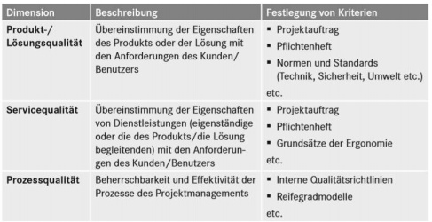
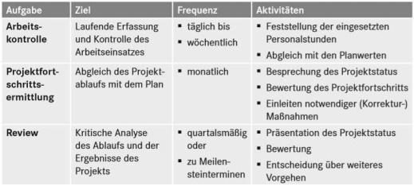

# Statusüberwachung & Projektsteuerung

## Nach Helmut E. Zsifkovits.

### IT-Projektcontrolling:

Das IT-Projektconrolling dient zur Abstimmung der Zielvorgaben und deren Umsetzung mit der Unternehmensstrategie. Es bietet Unterstützung im Projektmanagement bei dem Erreichen der Planungsvorgaben, welche in die Bereiche: Qualität, Funktionalität, Kosten & Zeit aufgegliedert werden. Des Weitern ist durch das Controlling die schnelle Feststellungen von Planabweichungen und deren Ursachen und somit die Entwicklung von Maßnahmen zur Korrektur von Abweichungen möglich. Die Steuerung im Rahmen des Projektumfangs und Zusammenwirkens von Projekten im Projekt-Portfolio wird ebenfalls, wie das Bewerten von Risiken und das Einleiten von Maßnahmen zur Risikobeherrschung, durch das Projektcontolling überwacht.

Es können diverse Schwierigkeiten bei IT-Projekten durch, die Vielzahl der Beteiligten und ihr unterschiedlicher Einfluss, die Relative Neuartigkeit bei Technologien und Verfahren, Zuordnungs- und Bewertungsprobleme bei IT-Kosten und Nutzeffekten, auftreten. Sowohl die Erleichterung dieser Schwierigkeiten, als auch Multiprojektcontrolling wird durch ein gutes IT-Projektcontrolling möglich.

Es gilt eine Einordnung in die Unternehmensstrategie und in die Informationsaufbereitung zu finden. Dabei kann es eine Unterstützung der Projektleitung bieten, aber auch außerhalb des eigentlichen Projekts und nicht weisungsbefugt wirken. 

Wichtige zu beachtende Faktoren sind: Zeit, Ressourcennutzung, Kosten und schwer beschreibbare Leistungen. 

Formen sind sowohl das Einzelprojektcontrolling, welches als Standard gilt, als auch das Multiprojektcontrolling, bei welchem die Gegenseitigen Projektabhängigkeiten beachtet werden müssen. In beiden Fällen wir zum einen ein Basisplan für das „Soll Ziel“ und zum anderen jeweils ein aktueller Plan für jedes aktuelle „Soll Ziel“ gefertigt. Damit ist als eine dritte Dimension in der Projektarbeit zu sehen, welche als Quellen Arbeitszeitaufzeichungen, Bestellungen, Rechnungen, Protokolle, Projektlogbücher und andere Projektdokumente nutzt. 

Die Mitarbeiter sollen Eigenleistung selbst aufschreiben, da so in geringerem Maß ein Überwachungsgefühl entsteht. 

Zur Negativabgrenzung wird eine Negativliste genutzt. 

#### Projektsteuerung: 
* Arten: Machbarkeits-, Planungs- & Umsetzungsprojekt 
* Einheiten: Organisationseinheiten, Leistungen, Technologien 

#### Kostenarten: 
* Personal-, Ressourcen(Maschinen)
* Sach(Material)
* Fremd- & Investitionskosten 

Fortschrittsberichte sollten für Kostenentwicklung, Motivation und Zeitplanung genutzt werden.

#### Projekt-Risikomanagement 

Das Projekt-Risikomanagement beschäftigt sich mit Risiken und Chancen in der Entwicklung. Es soll das Erkennen, Bewerten, so wie die schnelle Findung von Maßnahmen ermöglichen. Daher sind die Punkte der Risikomanagementplanung und Risikoidentifikation unverzichtbar und müssen mit einer qualitativen Risikoanalyse, welche die Auswirkung der Risiken auf Ziele darstellt, aber auch quantitativen Risikoanalyse, welche die Wahrscheinlichkeiten, Auswirkungen und Wirkung der Risiken findet, verbunden werden. Die Planung zur Risikobewältigung soll zur Vermeidung von Risiken dienen und deren Auswirkungen beherrschen. Bei der Risikoüberwachung und Risikoverfolgung wird das Überwachen von Restrisiken und die Identifikation von neuen Risiken in den Vordergrund gestellt. In der Ausführung bedeutet dies Risikobewältigungspläne anzufertigen und Wirksamkeit zu Bewerten. 

Das **Claim Management** kümmert sich darum Ansprüche des Kunden durch Verträge zu bearbeiten.

**Value Management EVM:** Soll Arbeit = *Planned Value*, zum Zeitpunkt Ist = *Earned Value* & Kosten tatsächlich = *Actual Cost*

Zyklen der Projektsteuerung: 

#### Projektsteuerung 

Sie umfasst: 
* Abstimmung Unternehmensstrategie, 
* Multiprojektmanagement, 
* Erstellung & Überwachung von Termin-, Organisations-, & Kostenplänen, 
* laufende Information des Auftraggebers, 
* Aufzeigen von Planabweichungen & Risiken, 
* Planen & Einleiten von Maßnahmen zur Projektziel-Erreichung, 
* rechtzeitiges Herbeiführen von Auftraggeber-Entscheidungen. 

**Zielkongruenz** = sich ergänzende Ziele 

**Quality Gates** = gemeinsame (Projektteam, Kunden, Lieferanten) Messung der Qualität und der Vollständigkeit dies resultiert in der Entscheidung über „Stop or Go“ (Stop = Pausierung/Überarbeitung des aktuellen Projektfortschritts, Go = Weiterführung der Entwicklung ) dabei sind Unterschiedliche Konsequenzen möglich.

#### Prozessreifegradmodelle: 

* **CMM-Modell/CMMI-Modell(Capability Maturity Model Integration)** 6 Stufen: 
  0.	Incomplete: nicht erkennbar, 
  1.	Performed: In- & Output erkennbar,  
  2.	Managed: Zeiten beschränkt kontrollierbar, Kosten & Qualität unterliegen Starken Schwankungen  
  3.	Definded: Qualität Schwankend, der Rest ist einigermaßen Zuverlässig, Doku vorhanden  
  4.	Quantitatively Managed: alles zuverlässig kontrollierbar  
  5.	Optimizing: Organisation auf finden von Schwächen ausgerichtet Quantitative Messungen zur Optimierung des Prozesses. 
* SPICE (Software Prozess Improvement & Capability Determination)/SIO/IEC: 
* Software, 6 Reifegrade Unvollständig, durchgeführt, gesteuert, etabliert, vorhergesagt & optimierend 
* **ITIL(IT Infrastructure Library):** Sammlung Best/Good Practices 

#### Weitere Methoden & Instrumente des Projektcontrollings: 
* Investitionsrechenverfahren, 
* Kosten-Nutzen-Analyse, 
* Nutzwertanalyse, 
* Kosten- & Erlösschätzmethoden, 
* Risikoanalysen, 
* Aussagefähigkeit erhöhen durch: Simulation/Prognose/Sensitivitätsanalyse, 
* In weiteren Projektphasen,  
* Zuschlagskalkulation,  
* Projektbezogene Finanz- & Liquiditätsplanung, 
* Einsatz von Einzelkennzahlen/Kennzahlensystem, 
* Function-Point-Methode, 
* **COCOMO(Constructive Cost Model)** algorithmisches Kostenmodell(nach Code). 

#### Projektcontrolling Software und Vorgehensarten: 
* Einzel-/Multiprojektmanagement-Systeme, 
* Enterprise Project Management-Systeme (Unternehmensweite Einbindung), 
* Projekt Collaboration Platform (Zusammenarbeit zwischen Personen), 
* Issue Tracking System (verwaltet Aufgabenlisten z.B. Kundenbeschwerden), 
* Projektportfoliomanagement (Abstimmung zwischen Gruppen & Projekten), 
* Dokumentenmanagement, 
* Webbasiert Umgebung.

#### M-Modell Phasen Projektlebenszyklus: 
Ideengenerierung, Ideenevaluierung, Portfolioplanung, Programmplanung, Projektplanung, Projektcontrolling, Programmcontrolling, Portfoliocontrolling, Programmabschluss & Projektabschluss 

Erweitert um Aufgabengebiete im Projektmanagement: 
* Personal Information Management, 
* Teamarbeit, 
* Administration, 
* Konfiguration,  
* Schnittstellen.
