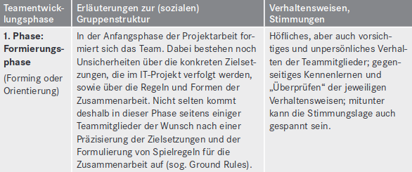
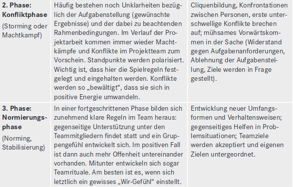
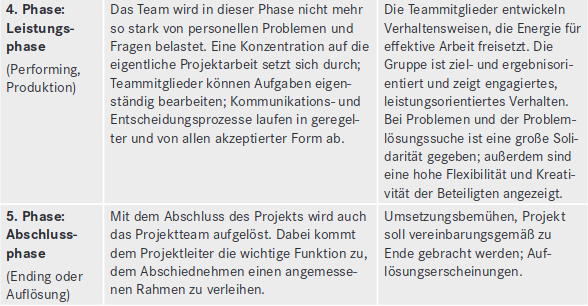
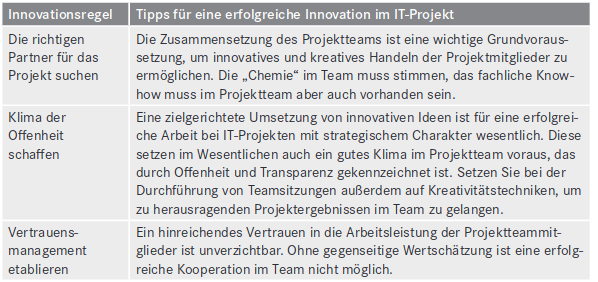
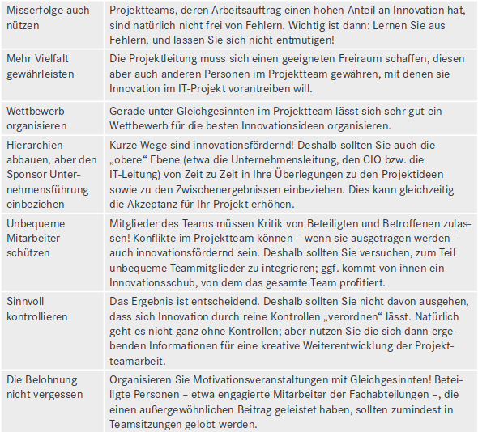
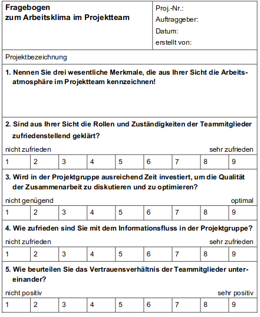

# Teamentwicklung
 
 Bei der Teamplanung ist darauf zu achten das Synergieeffekte entstehen. Das heißt das sich
die Kompetenzen der einzelnen Teammitglieder ergänzen. In der Praxis zeigt sich nämlich,
dass ein erfolgreiches Projektteam sich nicht anhand von erzielten Leistungen messen,
sondern auch in deren Möglichkeiten ein bestimmtes Ziel zu erreichen. So ist eine gute
Teamharmonie genauso anzustreben wie die Fachliche Kompetenz. Um eine
Teamentwicklung zu gewährleisten gibt es fünf Phasen, die sich über die Jahre etabliert
haben.

In diesen unterschiedlichen Phasen wird der Teamleiter unterschiedlich gefordert.
Im Laufe einer Teamentwicklung kann es zu verschiedenen Störungen kommen. Diese
Störungen sind z.B. Interesselosigkeit der Teammitglieder bei der Bearbeitung der
Teamaufgabe, Fehlendes Engagement und Verweigerung der Übernahme von
Verantwortung oder Unentschlossenheit bei der Entscheidungsfindung, Konflikte zwischen
Teammitgliedern oder Stresssituationen bei Mitarbeitern. Um auf diese Sachen zu reagieren
muss zunächst eine Ursachenanalyse gemacht werden. Ursachen können sein:
Kompetenzprobleme, Entscheidungsprobleme, Kommunikationsprobleme,
Informationsprobleme, Organisationsprobleme, Rollenkonflikte oder Beziehungsprobleme.
Sollte eines der genannten Probleme auftreten liegt es an dem Projektleiter eine Lösung zu
finden, um das Problem zu lösen.
Eine wichtige Aufgabe der Projektleitung ist es, die skizzierte Teamentwicklung im Hinblick
auf das Erreichten der Projektziele zu steuern. Der Projektleiter muss das Team so zu sagen
formen. Daher gibt es Maßnahmen zur Förderung von Teamentwicklungsprozessen. Dazu
gehört das die Merkmale von Top-Teams selbst vorbildlich zu verkörpern und das Team in
regelmäßigen Abständen zu motivieren.IT-Projekte zeichnen sich immer durch eine relative Neuartigkeit hinsichtlich der
angestrebten Ergebnisse aus. Ziel der Projektleitung muss es deshalb sein ein positives
Innovationsklima zu schaffen. Dies erhöht nicht nur dich Produktionsqualität, sondern es
wird auch in gewissen Maßen an Zeit gespart. Hierfür gibt es so genannte "Goldene
Innovationsregeln".

Um die Qualität der Projektteamarbeit zu evaluieren und zu verbessern kann ein Fragebogen
an die Projektteilnehmer verteilt werden.

Anhand einer solchen Umfrage können bei negativen Werten entsprechend Maßnahmen
getroffen werden. Zudem können so Anregungen zur Optimierung gefunden werden.
Damit möglich Probleme gar nicht erst auftreten, ist es die Aufgabe des IT-Projektleiters,
eine förderliche Teamkultur aufzubauen und durch entsprechende Maßnahmen den
Wirkungsgrad des Projektteams zu erhöhen.
